.. _children-chapter:

Раздел «Дети»
=============
В главе рассмотрена работа с разделом «Дети», в котором осуществлен функционал по работе с данными по детям.
В разделе можно осуществить выборку данных, добавить данные по детям, изменить или удалить их.

Список детей
------------

Персональные данные ребенка
---------------------------

Список персональных данных ребенка, учитываемых в программе:

* Фамилия
* Имя
* Отчество
* Дата рождения

и данных адреса ребенка

* Населенный пункт
* Улица - необязательный параметр
* Дом - необязательный параметр
* Квартира - необязательный параметр

Список населенных пунктов берется из справочника "Населенные пункты", список улиц из справочника "Улицы".

Добавление ребенка
~~~~~~~~~~~~~~~~~~

Для добавления ребенка в систему необходимо нажать на кнопку «Добавить» на разделе «Дети»

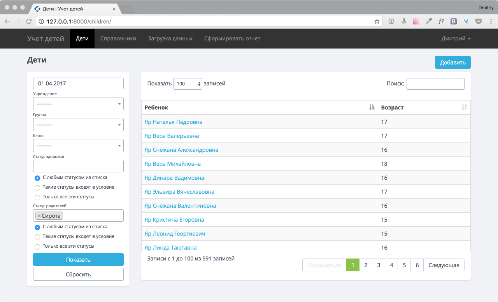

На открывшейся странице заполняем основные данные для внесения ребенка в систему

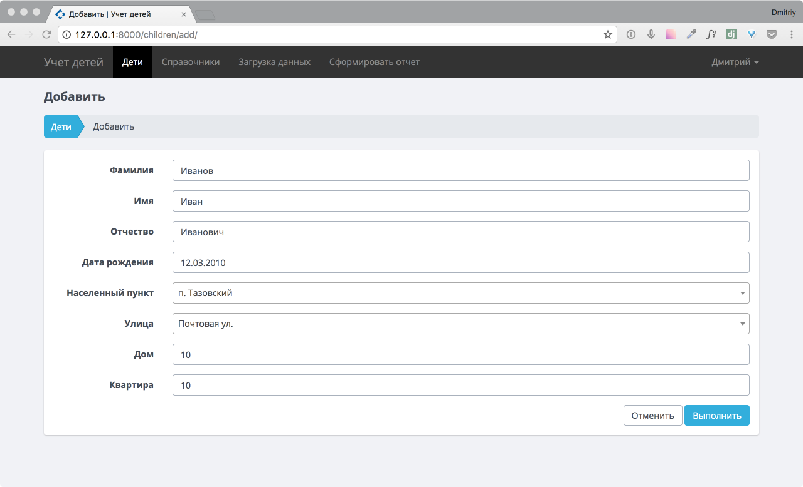

.. note:: *Разделы «Населенный пункт» и «Улица» заполняются из соответствующих справочников.*

После внесения данных, нажав на кнопку «Выполнить» будет открыта индивидуальная страница ребенка, в которой находятся все данные по ребенку.

Редактирование данных у ребенка
~~~~~~~~~~~~~~~~~~~~~~~~~~~~~~~

На индивидуальной странице ребенка нажимаем кнопку «Редактировать».
В отрывшейся странице можно отредактировать соответствующие данные.

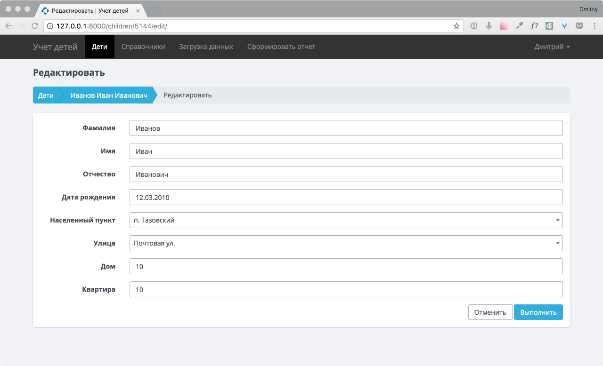

Удаление ребенка
~~~~~~~~~~~~~~~~
на индивидуальной странице ребенка нажимаем кнопку «Удалить».
В открывшемся диалоговом окне подтверждаем действие удаления, повторно нажав на кнопку «Удалить».

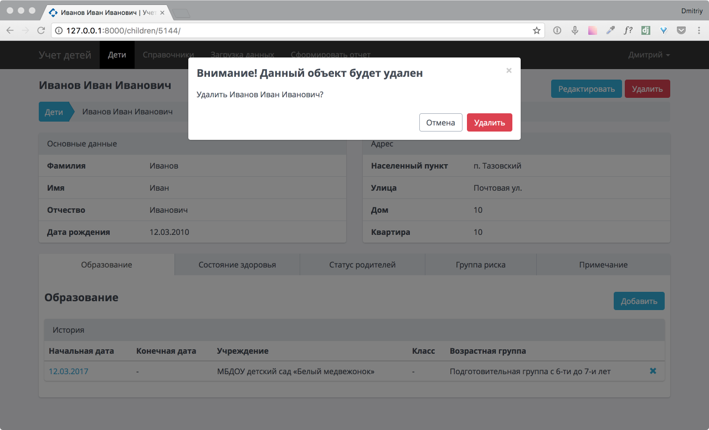

История ребенка
---------------

В истории ребенка учитываются следующие данные:

* :ref:`children-education-label` - история образования ребенка
* :ref:`children-health-label` - состояние здоровья ребенка
* :ref:`children-parent-label`- статус родителей ребенка
* :ref:`children-risk-label` - относится семья к группе риска или нет
* :ref:`children-note-label` - текстовое примечание

Заполняемые поля у всех историй:

* Начальная дата - дата начала истории показателя.
* Конечная дата - дата закрытия истории показателя

.. note:: *Конечная дата заполняется при закрытии истории показателя, при переводах еее можно не закрывать, она установится предыдущим днем, при внесении новой истории у показателя*

.. _children-education-label:

Образование
~~~~~~~~~~~

Заполнение истории образования необходимо, для включения ребенка в свод по образовательным учреждениям.
В истории образования заполняются следующие поля:
* Учреждение - образовательное учреждение.
* Группа - возростная группа ребенка
* Класс

Список образовательных учреждений берется из справочника образовательных учреждений - "Учреждения", список возростных групп из справочника "Группы", а список классов из справочника "Классы".

Добавление образования
""""""""""""""""""""""

На данную страницу можно попасть перейдя по ссылке на ФИО ребенка из разделе «Дети».

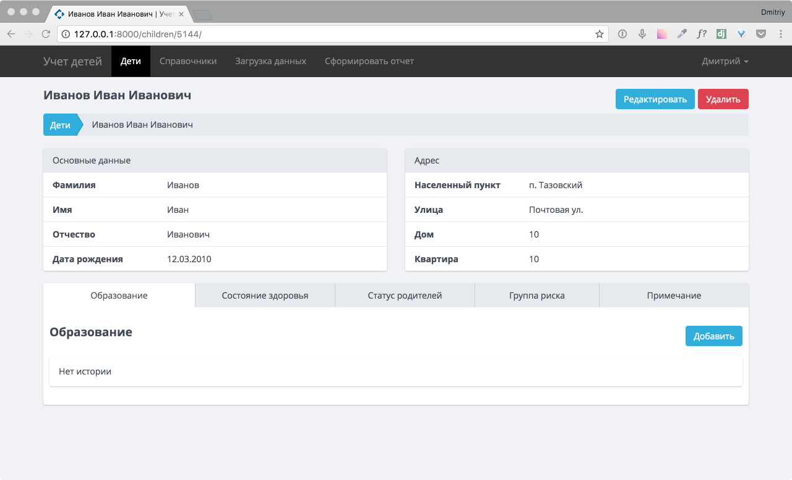

На индивидуальной странице ребенка на вкладке «Образование» нажимаем кнопу «Добавить» попадаем на страницу

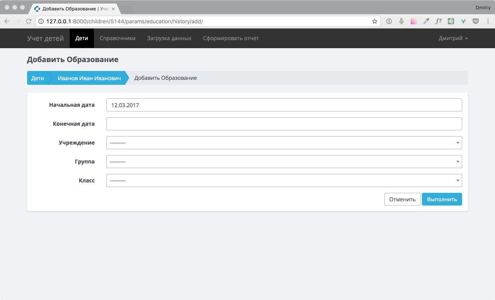

.. note:: *Разделы «Учреждение» , «Группа» и «Класс» заполняются из соответствующих справочников.*

После добавления данных они появятся на индивидуальной странице в соответствующей вкладке

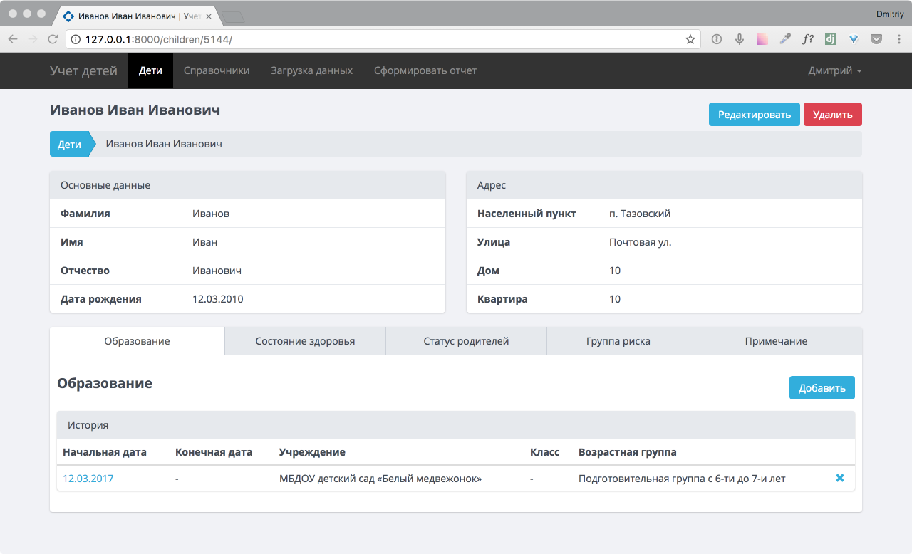

.. note:: *Если осуществляется добавление образование данных к уже присудствующим данным, т.е. осуществляется перевод ребенка в другую группу/класс/учреждение у предыдущей записи появися дата закрытия истории*

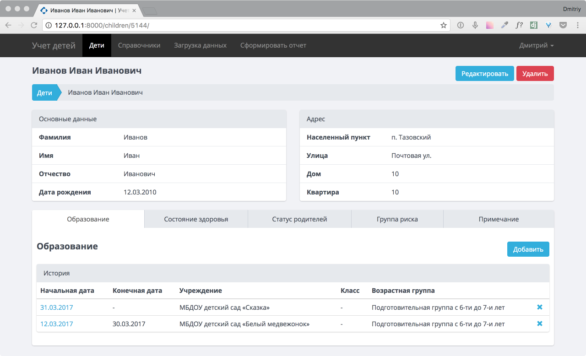

Редактирование образования
""""""""""""""""""""""""""

На индивидуальной странице ребенка на вкладке «Образование» нажимаем на дату в истории, которую хотим отредактировать.
В открывшейся странице изменяем нужные данные.

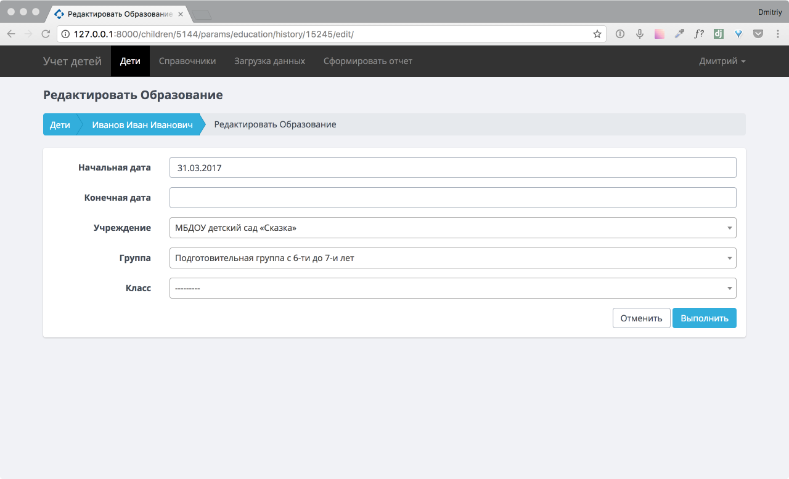

Удаление записи об образовании
""""""""""""""""""""""""""""""

На индивидуальной странице ребенка на вкладке «Образование» нажимаем на крестик у записи, которую хотим удалить, в открывшемся диалоговом окне подтверждаем удаление, нажав на кнопку «Удалить»

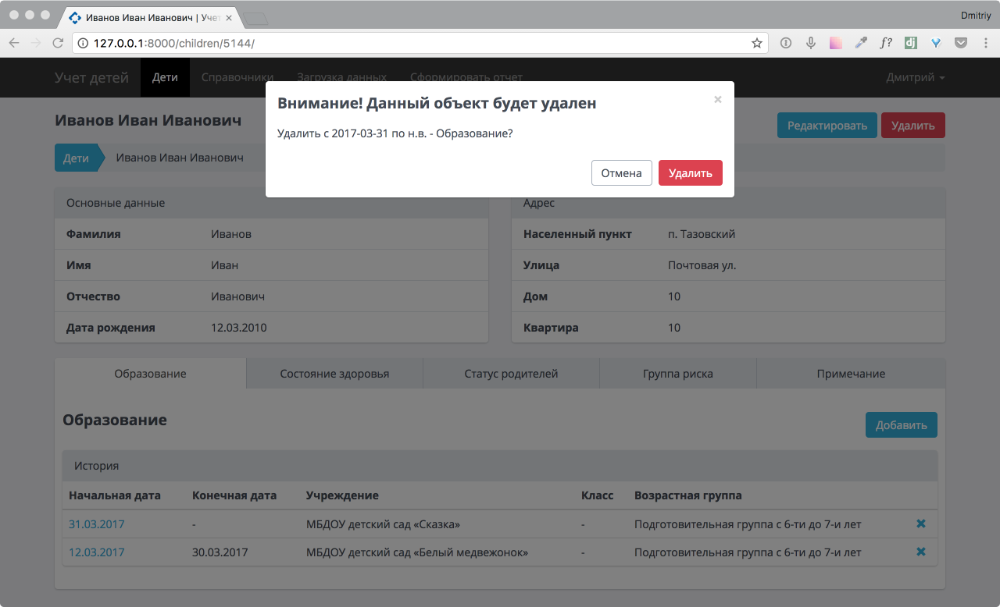

.. note:: *Для изменения записи образования, например при окончании учебного заведения удалять записи не надо, надо поставить дату закрытия истории у крайней записи в истории*

.. _children-health-label:

Состояние здоровья
~~~~~~~~~~~~~~~~~~

История по состоянию здоровья у ребенка.
Список состояний здоровья берется из справочника - "Состояние здоровья".

.. note:: *Состояние здоровья - множественный параметр, т.е. может быть выбрано несколько состояний здоровьья одновременно.*

Добавление состояния здоровья ребенку
"""""""""""""""""""""""""""""""""""""

На индивидуальной странице ребенка на вкладке «Состояние здоровья» нажимаем кнопу «Добавить» попадаем на страницу

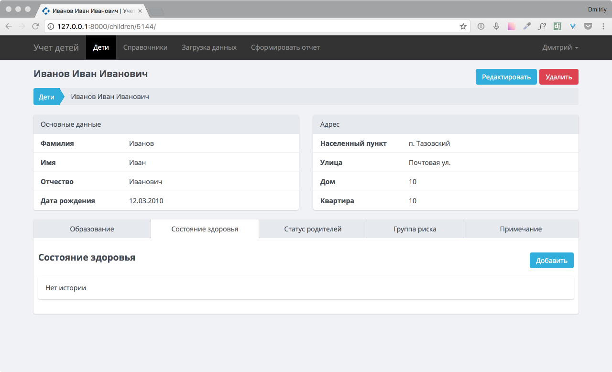

.. note:: *Раздел «Состояние здоровья» заполняются из соответствующего справочника.*

После добавления данных они появятся на индивидуальной странице в соответствующей вкладке

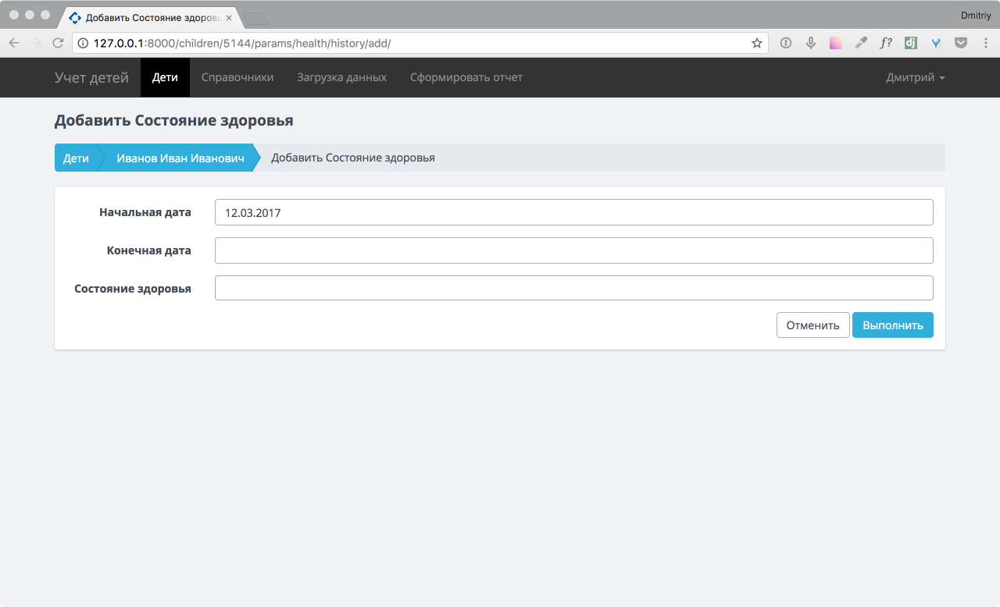

Редактирование состояния здоровья
"""""""""""""""""""""""""""""""""

На индивидуальной странице ребенка на вкладке «Образование» нажимаем на дату в истории, которую хотите отредактировать.
В открывшейся странице изменяем нужные данные.

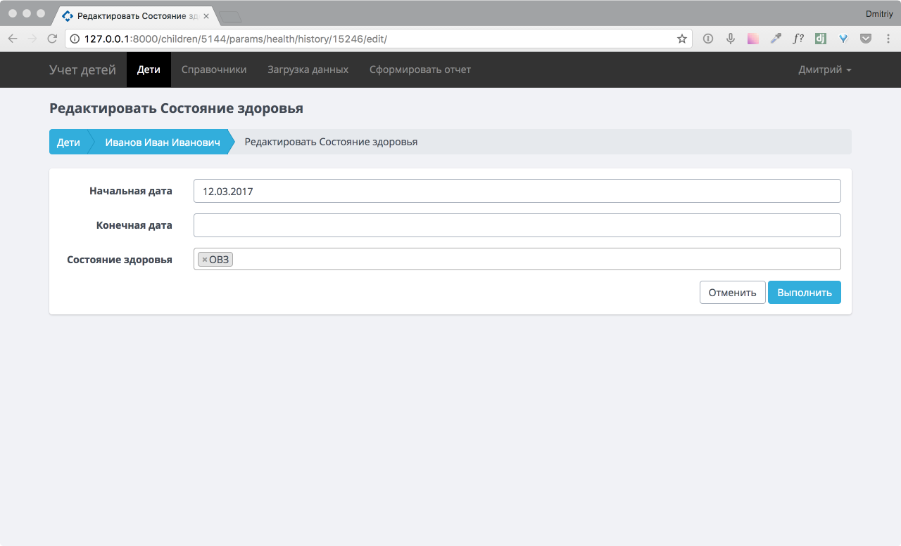

Удаление записи об состояния здоровья
"""""""""""""""""""""""""""""""""""""

На индивидуальной странице ребенка на вкладке «Образование» нажимаем на крестик у записи, которую хотите удалить, в открывшемся диалоговом окне подтверждаем удаление, нажав на кнопку «Удалить»

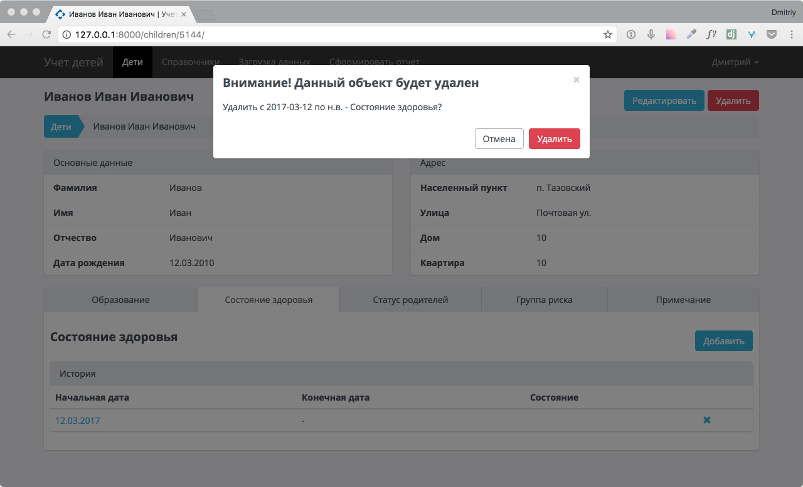

.. note:: *Для изменения записи состояния здоровья, например при смене диагноза (его отмене) удалять запись не надо, надо поставить дату закрытия истории.*

.. _children-parent-label:

Статус родителей
~~~~~~~~~~~~~~~~

История статуса родителей у ребенка
Список статусов родителей берется из справочника - "Статусы родителей".

.. note:: *Статус родителей - множественный параметр, т.е. может быть выбрано несколько статусов одновременно.*

Добавление статуса родителей ребенку
""""""""""""""""""""""""""""""""""""

На индивидуальной странице ребенка на вкладке «Статус родителей» нажимаем кнопу «Добавить» попадаем на страницу

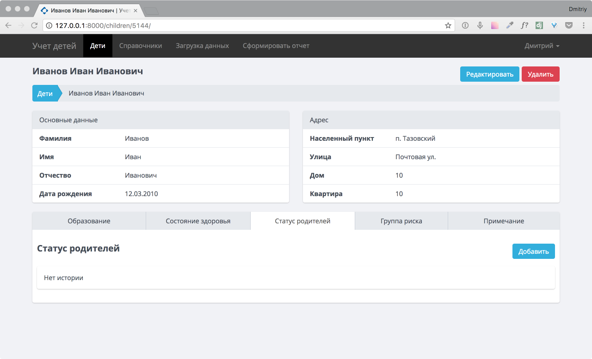

.. note:: *Раздел «Статус родителей» заполняются из соответствующего справочника.*

После добавления данных они появятся на индивидуальной странице в соответствующей вкладке.

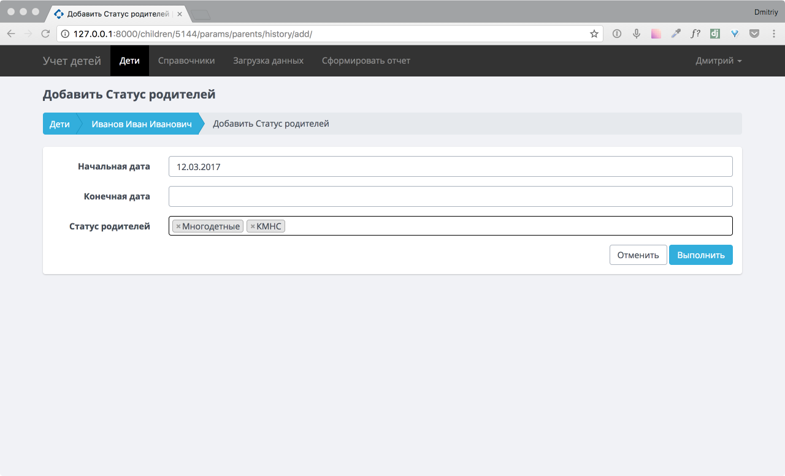

Редактирование статуса родителей
""""""""""""""""""""""""""""""""

На индивидуальной странице ребенка на вкладке «Статус родителей» нажимаем на дату в истории, которую хотите отредактировать.
В открывшейся странице изменяем нужные данные.

Удаление записи о статусе родителей
"""""""""""""""""""""""""""""""""""

На индивидуальной странице ребенка на вкладке «Статус родителей» нажимаем на крестик у записи, которую хотите удалить, в открывшемся диалоговом окне подтверждаем удаление, нажав на кнопку «Удалить»

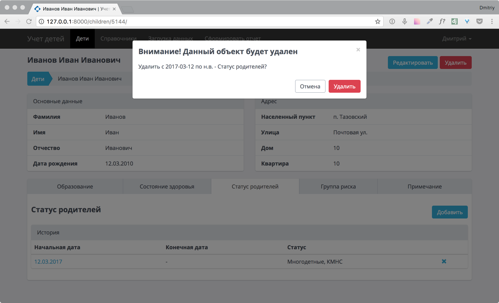

.. _children-risk-label:

Группа риска
~~~~~~~~~~~~

История в которой отмечается, относится ребенок к группе риска или нет

Добавление в группу риска
"""""""""""""""""""""""""

На индивидуальной странице ребенка на вкладке «Группа риска» нажимаем кнопу «Добавить» попадаем на страницу

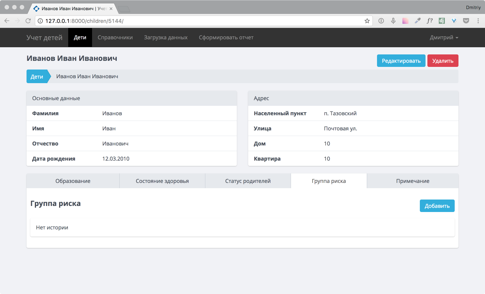

После добавления данных они появятся на индивидуальной странице в соответствующей вкладке.

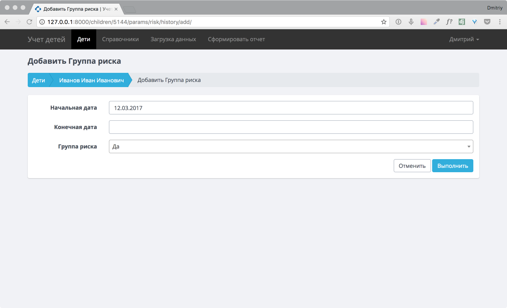

Редактирование группу риска у ребенка
"""""""""""""""""""""""""""""""""""""

На индивидуальной странице ребенка на вкладке «Группа риска» нажимаем на дату в истории, которую хотите отредактировать.
В открывшейся странице изменяем нужные данные.

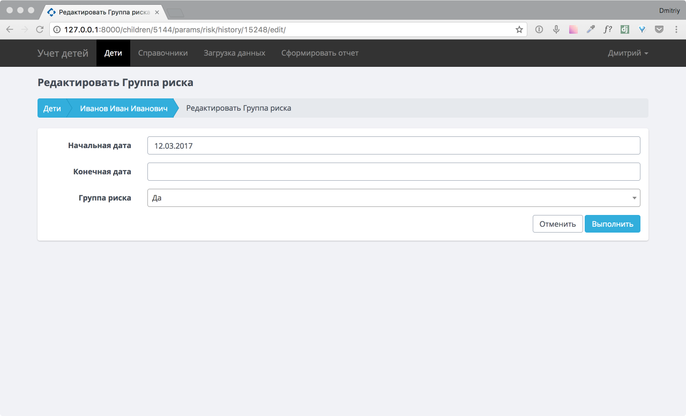

Удаление записи о группу риска
""""""""""""""""""""""""""""""

На индивидуальной странице ребенка на вкладке «Группа риска» нажимаем на крестик у записи, которую хотите удалить, в открывшемся диалоговом окне подтверждаем удаление, нажав на кнопку «Удалить»

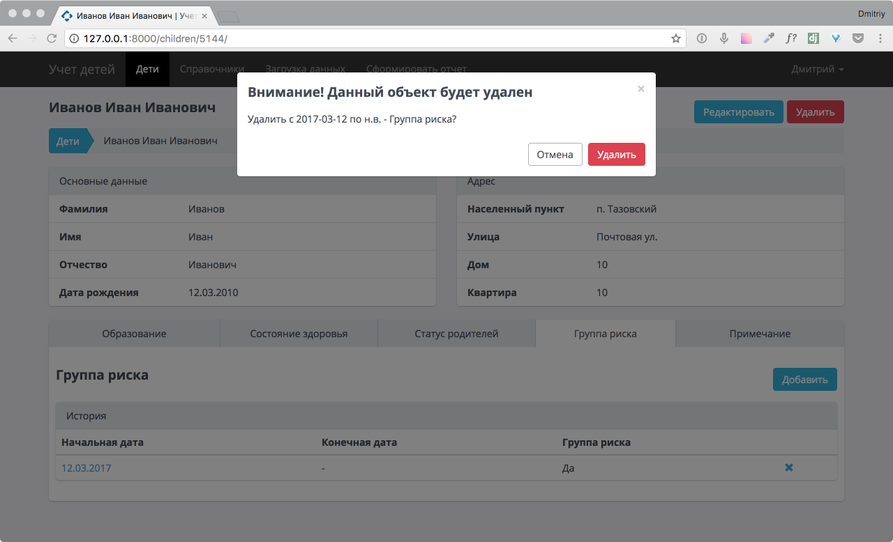

.. _children-note-label:

Примечание
~~~~~~~~~~

Текстовое поле "Примечание" с историей.

Добавление примечания
"""""""""""""""""""""

На индивидуальной странице ребенка на вкладке «Примечание» нажимаем кнопу «Добавить» попадаем на страницу

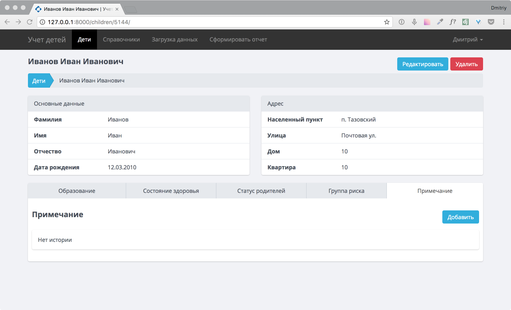

После добавления данных они появятся на индивидуальной странице в соответствующей вкладке.

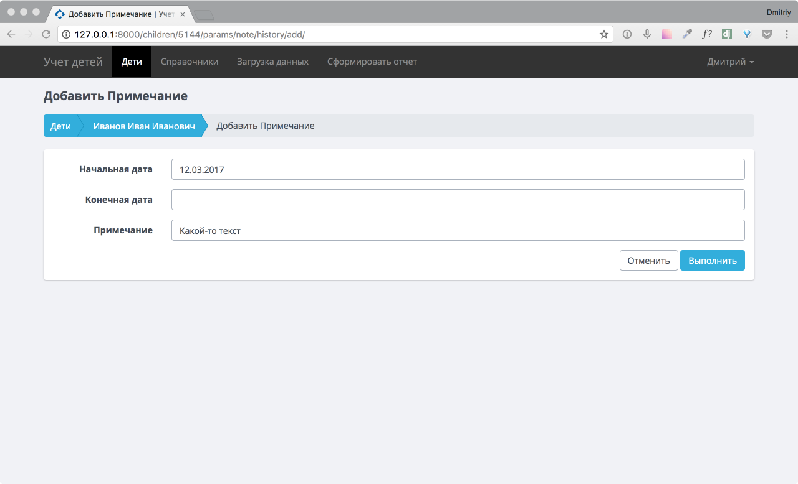

Редактирование примечания
"""""""""""""""""""""""""

На индивидуальной странице ребенка на вкладке «Примечание» нажимаем на дату в истории, которую хотите отредактировать.
В открывшейся странице изменяем нужные данные.

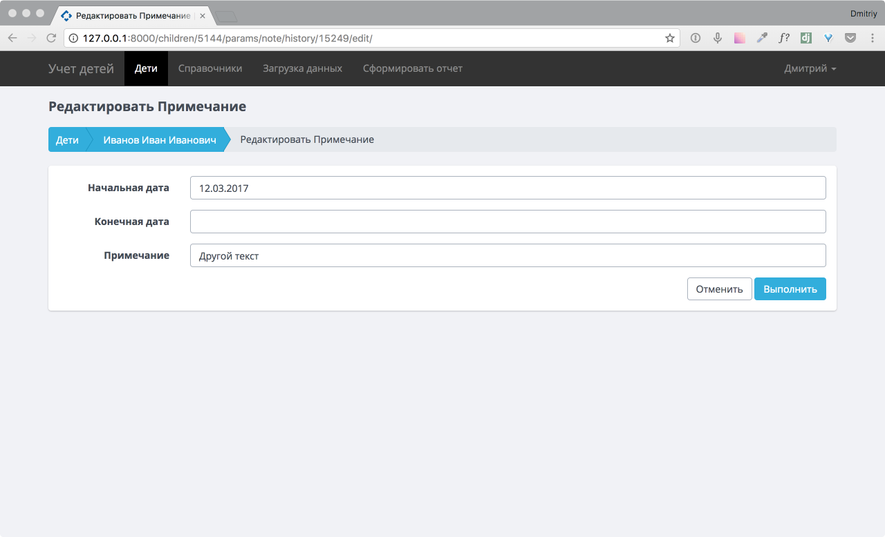

Удаление примечания
"""""""""""""""""""

На индивидуальной странице ребенка на вкладке «Примечание» нажимаем на крестик у записи, которую хотите удалить, в открывшемся диалоговом окне подтверждаем удаление, нажав на кнопку «Удалить»

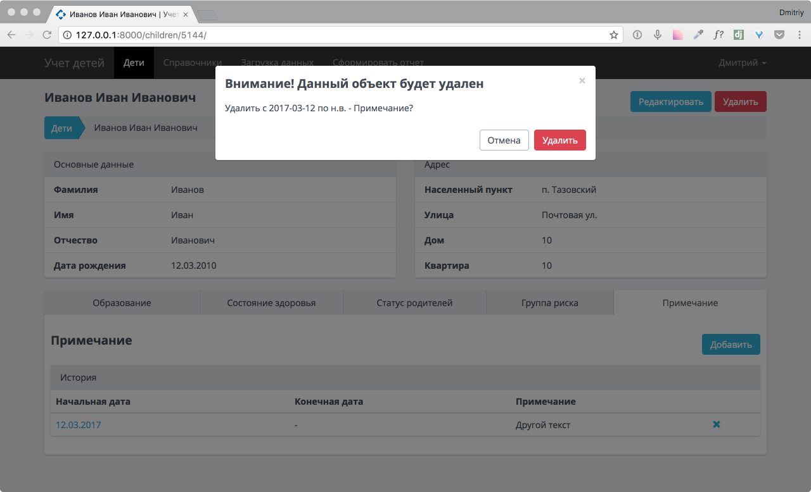

