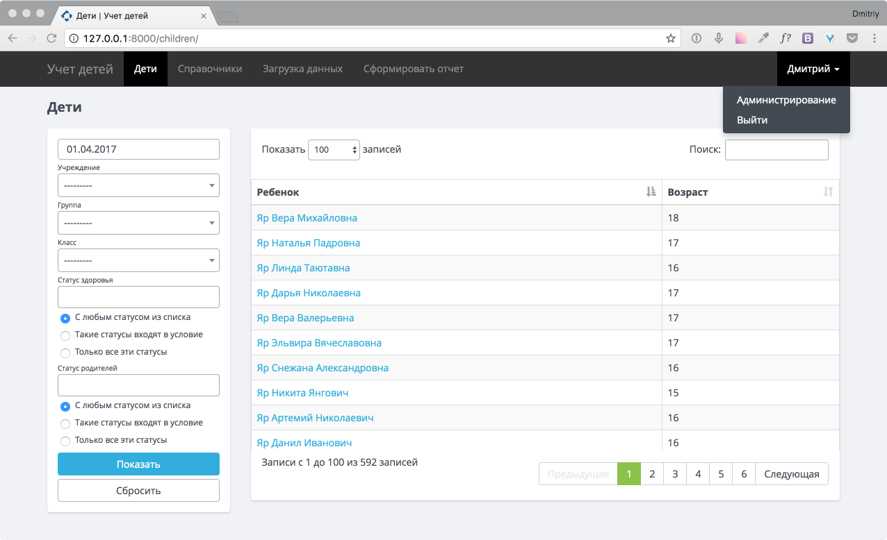
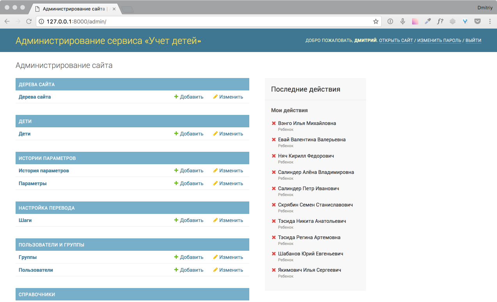
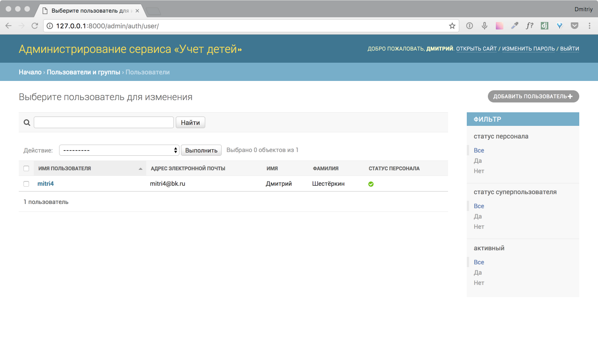
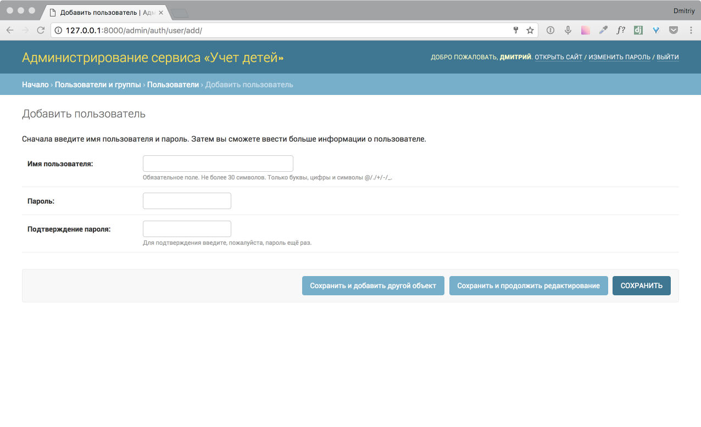
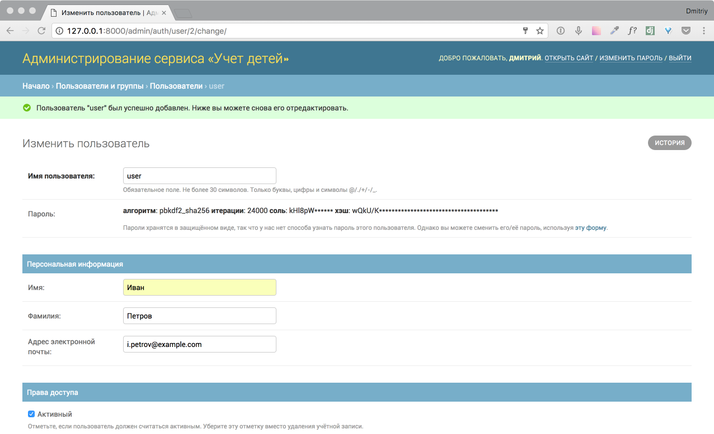
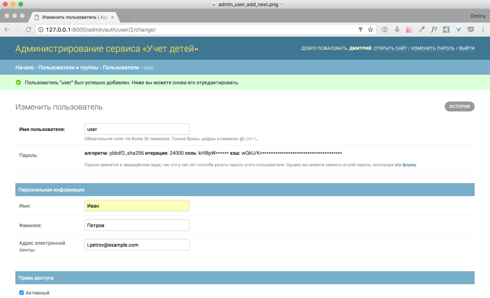
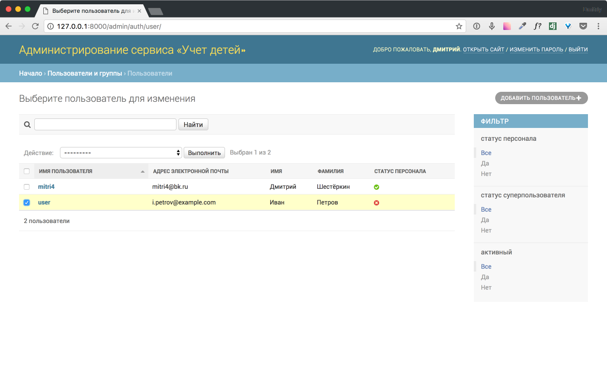
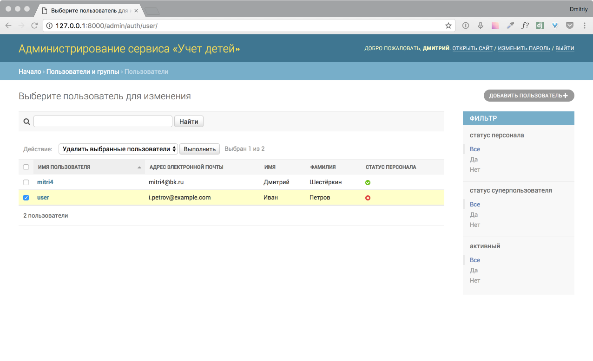
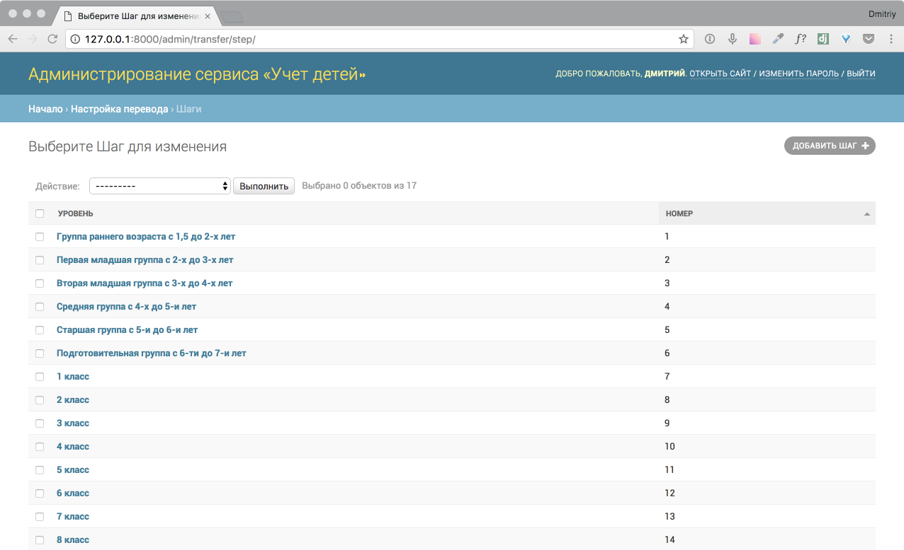
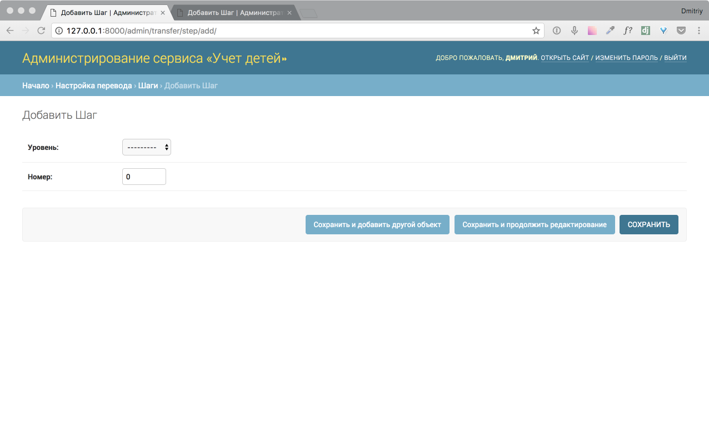

.. _admin-chapter:

Администрирование
=================
В главе рассмотрен раздел управления пользователями системы и настройка очередности автоперевода детей на 1 сентября каждого года.

Вход в админский раздел осуществляется с главного меню.Необходимо нажать на имя пользователя и в открывшемся выпадающем списке выбрать пункт «Администрирование»

    Вход в раздел «Администрирование»

На основной странице администрироания нас интересуют разделы «ПОЛЬЗОВАТЕЛИ И ГРУППЫ» и «НАСТРОЙКА ПЕРЕВОДА»

    Основная страница «Администрирования»

Пользователи
------------

На страницу с пользователями попадаем из основной страницы «Администрирования» нажав на ссылку «Пользователи» в разделе «ПОЛЬЗОВАТЕЛИ И ГРУППЫ»

    Страница «Пользователи»

Добавление
~~~~~~~~~~

Добавить пользователя можно как с основной страницы «Администрирования» нажав на кнопку «+ Добавить» у раздела
так и на странице со списком пользователей, переити на которую можно с главной страницы администрирования нажав на ссылку «Пользователи» и на странице с пользователями нажать на кнопку «Добавить пользователя +»

    Добавлени пользователя

Заполнив необходимые поля нажимаем «Сохранить»
В следующем окне заполняем поля «Имя» и «Фамилия» и нажимаем «Сохранить»

    Добавлени пользователя (следующая страница)

.. _user-edit-label:

Редактирование
~~~~~~~~~~~~~~

Для редактирования пользователя нажимаем на имя пользователя на странице «Пользователи» и попадаем на страницу редактирования пользователя

    Страница редактирования пользователя

.. _user-delete-label:

Удаление
~~~~~~~~

Удаление пользователя осуществляется на странице редактирования пользователя, нажав на кнопку «Удалить». Подтвердив удаление, пользователь будет удален.
Так же пользоватеял можно удалить выбрав его нажав на флаг слева от имени пользователя.

    Выбор записи пользователя

Далее у действия выбираем пункт «Удалить выбранных пользователей» и нажимаем «Выполнить»

    Выбор действия с пользователем

Настройка перевода
------------------

    Настройка очередности перевода

В текущем разделе можно добавлять / удалять / редактировать очередности автоперевода детей.Попасть в него можно с главной страницы «Администрирование» нажав на ссылку «Шаги» в разделе «НАСТРОЙКА ПЕРЕВОДА»

Добавление шага
~~~~~~~~~~~~~~~

Осуществляется аналагично добавлению пользователя. Выбор уровня осуществляется из свободных еще не задейстованных этапов. Список уровней формируется из списка возростных групп и классов. Поле «Номер» - это номер очередности.

    Добавление очередности

Редактирование
~~~~~~~~~~~~~~
Осуществляется аналагично операции редактирования пользователя.(см :ref:`user-edit-label` пользователя)

Удаление
~~~~~~~~
Осуществляется аналагично операции удаления пользователя.(см :ref:`user-delete-label` пользователя)
