.. _children-chapter:

Раздел «Дети»
=============
В главе рассмотрена работа с разделом «Дети», в котором осуществлён функционал по работе с данными по детям.
В разделе можно осуществить выборку данных, добавить данные по детям, изменить или удалить их.

Список детей
------------

Фильтрация списка
~~~~~~~~~~~~~~~~~

На главной странице раздела находится общий список детей.

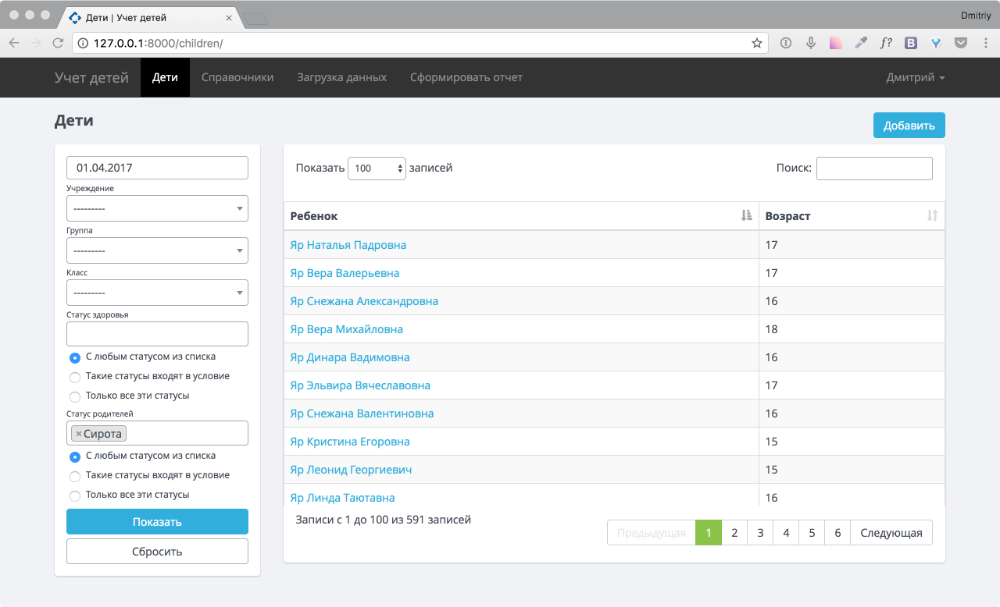

    Список детей

Фильтр дает возможность отобрать данные на дату по следующим показателям.

* Дата - данные будут выбранны на эту дату
* Учреждение - будет влюченны дети, обучающиеся в выбранном учреждении
* Группа - будет влючены дети, относящиеся к выбранной возростной группе
* Класс - будет влючены дети, относящиеся к выбранному классу
* Статус родителей.
    Выбираются дети с указанными статусами родителей. Необходимо уточнить условия поиска выбрав из указанного списка

    * С любым статусом из списка - в данное условие попадают дети относящиеся к выбранным условиям «или-или», т.е., если мы указали в условии «КМНС» и «Многодетные» то выберутся дети со статусом родителей или «КМНС» или «Многодетные»

    * Такие статусы входят в условие - в данное условие попадают дети относящиеся к выбранным условиям «и-и», т.е., если мы указали в условии «КМНС» и «Многодетные» то выберутся дети со статусом родителей и «КМНС» и «Многодетные» и также содержащиеся другие условия

    * Только все эти статусы - в данное условие попадают дети относящиеся к выбранным условиям «и-и», т.е., если мы указали в условии «КМНС» и «Многодетные» то выберутся дети со статусом родителей только «КМНС» и «Многодетные» и не содержащие никаких других статусов.
* Статус здоровья.
    Будут выбраны дети с указанными статусами здоровья. Необходимо уточнить условия поиска выбрав из указанного списка. Аналогично, как и со статусами родителей

    * С любым статусом из списка
    * Такие статусы входят в условие
    * Только все эти статусы

Сортировка списка
~~~~~~~~~~~~~~~~~

Выбранный список детей можно сортировать по ФИО и по возрасту, нажав на заголовок соответствующего поля.

Поиск в списке
~~~~~~~~~~~~~~

В выбранном списке можно найти ребёнка, введя фамилию , имя , отчество или их сочетание или первые буквы содержащиеся в них в поле «Поиск»

Персональные данные ребёнка
---------------------------

Список персональных данных ребёнка, учитываемых в программе:

* Фамилия
* Имя
* Отчество
* Дата рождения

и данных адреса ребёнка

* Населенный пункт
* Улица - необязательный параметр
* Дом - необязательный параметр
* Квартира - необязательный параметр

Список населенных пунктов берется из справочника "Населенные пункты", список улиц из справочника "Улицы".

Добавление ребёнка
~~~~~~~~~~~~~~~~~~

Для добавления ребёнка в систему необходимо нажать на кнопку «Добавить» на разделе «Дети»

    Список детей

На открывшейся странице заполняем основные данные для внесения ребёнка в систему

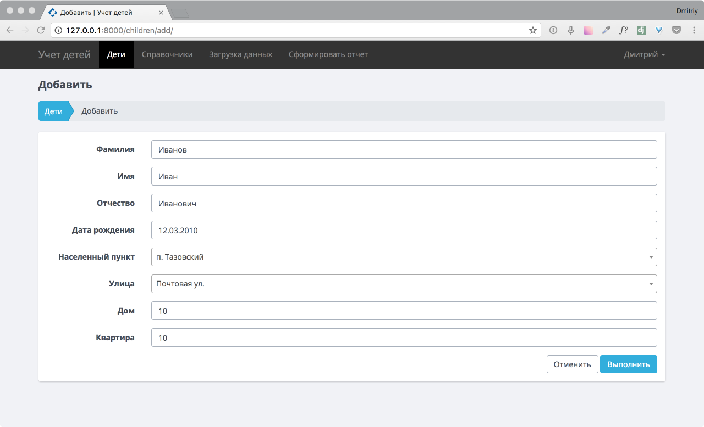

    Стараница добавления ребёнка

.. note:: *Разделы «Населенный пункт» и «Улица» заполняются из соответствующих справочников.*

После внесения данных, нажав на кнопку «Выполнить» будет открыта индивидуальная страница ребёнка, в которой находятся все данные по ребенку.

Редактирование данных ребёнка
~~~~~~~~~~~~~~~~~~~~~~~~~~~~~

На индивидуальной странице ребёнка нажимаем кнопку «Редактировать».
В отрывшейся странице можно отредактировать соответствующие данные.

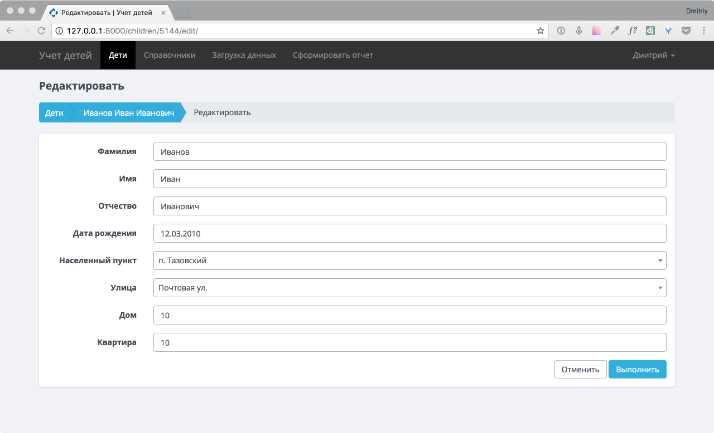

    Стараница редактирования данных ребёнка

Удаление ребёнка из данных
~~~~~~~~~~~~~~~~~~~~~~~~~~
на индивидуальной странице ребёнка нажимаем кнопку «Удалить».
В открывшемся диалоговом окне подтверждаем действие удаления, повторно нажав на кнопку «Удалить».

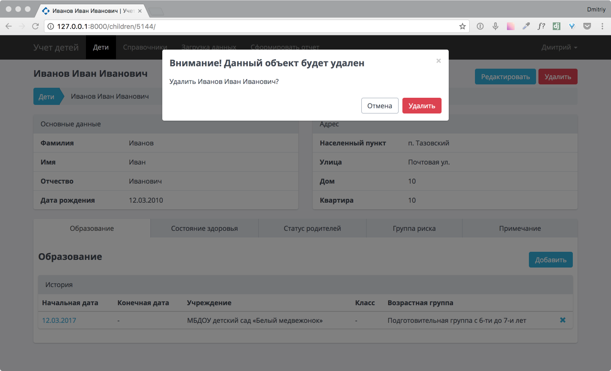

    Страница удаления данных ребёнка

История ребёнка
---------------

В истории ребёнка учитываются следующие данные:

* :ref:`children-education-label` - история образования ребёнка
* :ref:`children-health-label` - состояние здоровья ребёнка
* :ref:`children-parent-label`- статус родителей ребёнка
* :ref:`children-risk-label` - относится семья к группе риска или нет
* :ref:`children-note-label` - текстовое примечание

Заполняемые поля у всех историй:

* Начальная дата - дата начала истории показателя.
* Конечная дата - дата закрытия истории показателя

.. note:: *Конечная дата заполняется при закрытии истории показателя, при переводах ее можно не закрывать, она установится предыдущим днем, при внесении новой истории у показателя*

.. _children-education-label:

Образование
~~~~~~~~~~~

Заполнение истории образования необходимо, для включения ребёнка в свод по образовательным учреждениям.
В истории образования заполняются следующие поля:
* Учреждение - образовательное учреждение.
* Группа - возрастная группа ребёнка
* Класс

Список образовательных учреждений берется из справочника образовательных учреждений - "Учреждения", список возрастных групп из справочника "Группы", а список классов из справочника "Классы".

Добавление образования
""""""""""""""""""""""

На данную страницу можно попасть, перейдя по ссылке на ФИО ребёнка из разделе «Дети».

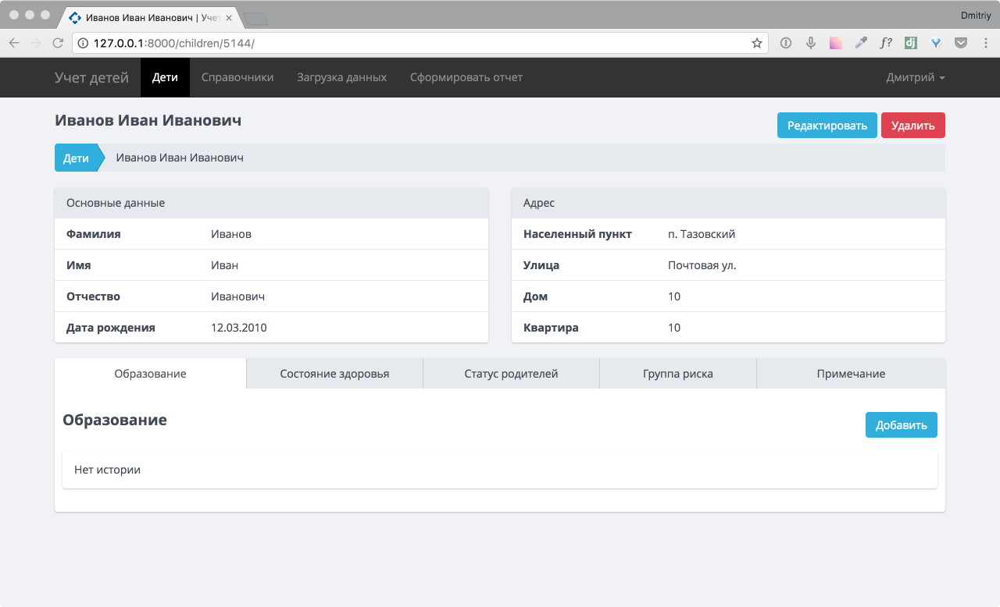

    Страница данных ребёнка

На индивидуальной странице ребёнка на вкладке «Образование» нажимаем кнопу «Добавить» попадаем на страницу

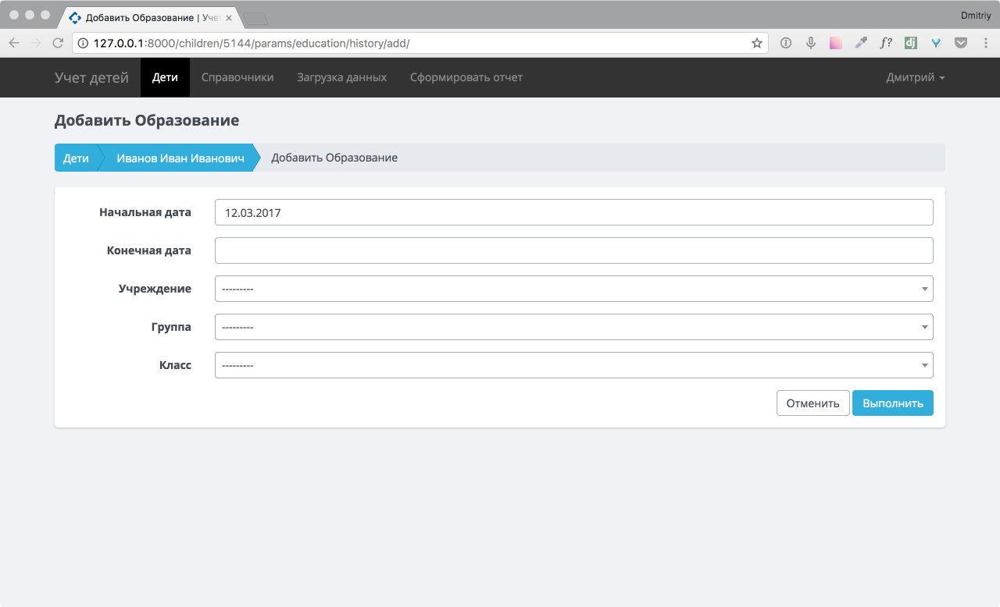

    Страница добавления истории образования ребёнка

.. note:: *Разделы «Учреждение» , «Группа» и «Класс» заполняются из соответствующих справочников.*

После добавления данных они появятся на индивидуальной странице в соответствующей вкладке

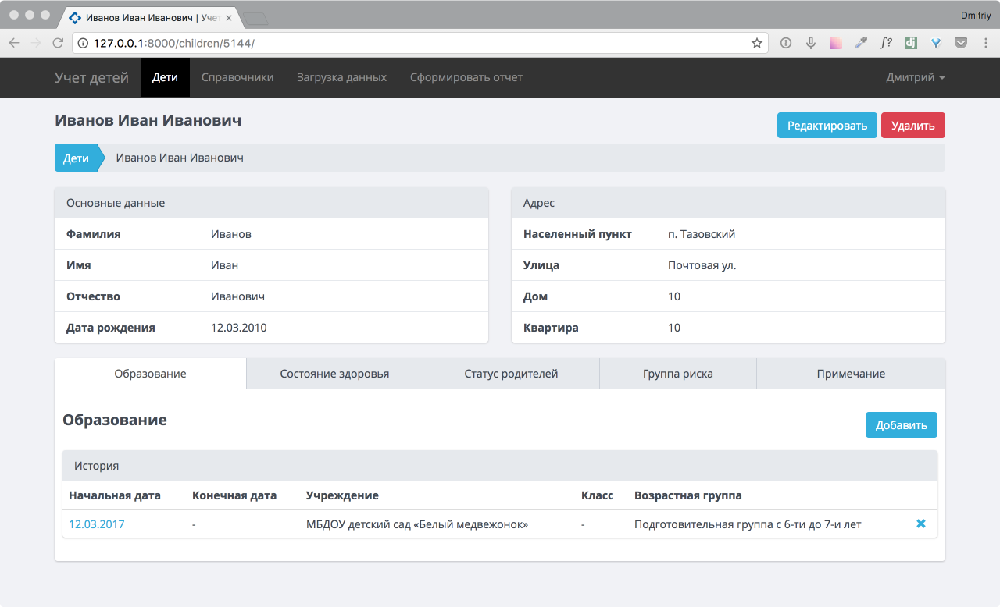

    Страница данных ребёнка - Вкладка «Образование»

.. note:: *Если осуществляется добавление образование данных к уже присутствующим  данным, т.е. осуществляется перевод ребёнка в другую группу/класс/учреждение у предыдущей записи появися дата закрытия истории*

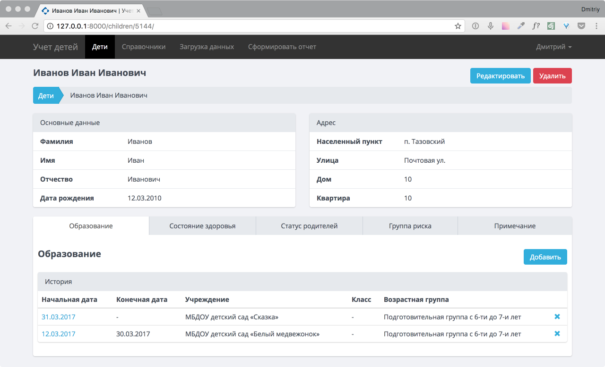

    Пример истории с несколькими записями

Редактирование образования
""""""""""""""""""""""""""

На индивидуальной странице ребёнка на вкладке «Образование» нажимаем на дату в истории, которую хотим отредактировать.
В открывшейся странице изменяем нужные данные.

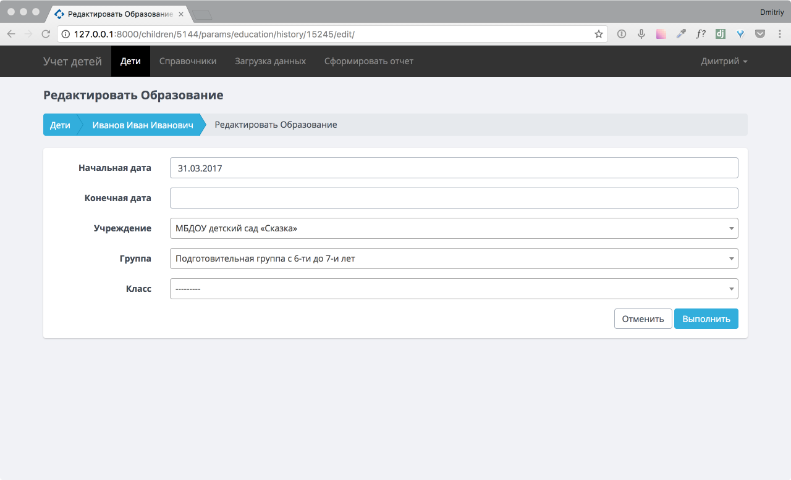

    Страница редактирования истории образования

Удаление записи об образовании
""""""""""""""""""""""""""""""

На индивидуальной странице ребёнка на вкладке «Образование» нажимаем на крестик у записи, которую хотим удалить, в открывшемся диалоговом окне подтверждаем удаление, нажав на кнопку «Удалить»

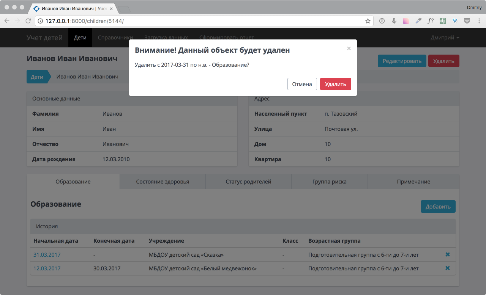

    Удаление истории «Образование»

.. note:: *Для изменения записи образования, например при окончании учебного заведения удалять записи не надо, надо поставить дату закрытия истории у крайней записи в истории*

.. _children-health-label:

Состояние здоровья
~~~~~~~~~~~~~~~~~~

История по состоянию здоровья у ребёнка.
Список состояний здоровья берется из справочника - «Состояние здоровья».

.. note:: *Состояние здоровья - множественный параметр, т.е. может быть выбрано несколько состояний здоровья одновременно.*

Добавление состояния здоровья ребёнка
"""""""""""""""""""""""""""""""""""""

На индивидуальной странице ребёнка на вкладке «Состояние здоровья» нажимаем кнопу «Добавить» попадаем на страницу

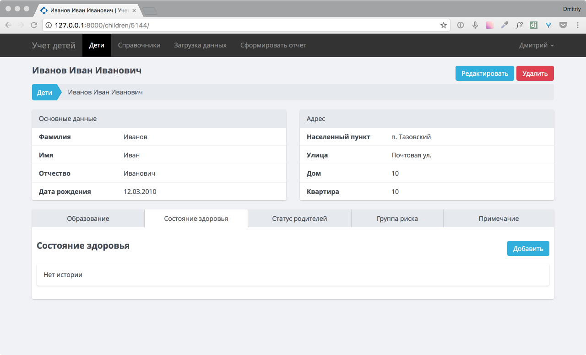

    Страница данных ребёнка - Вкладка образование

.. note:: *Раздел «Состояние здоровья» заполняются из соответствующего справочника.*

После добавления данных они появятся на индивидуальной странице в соответствующей вкладке

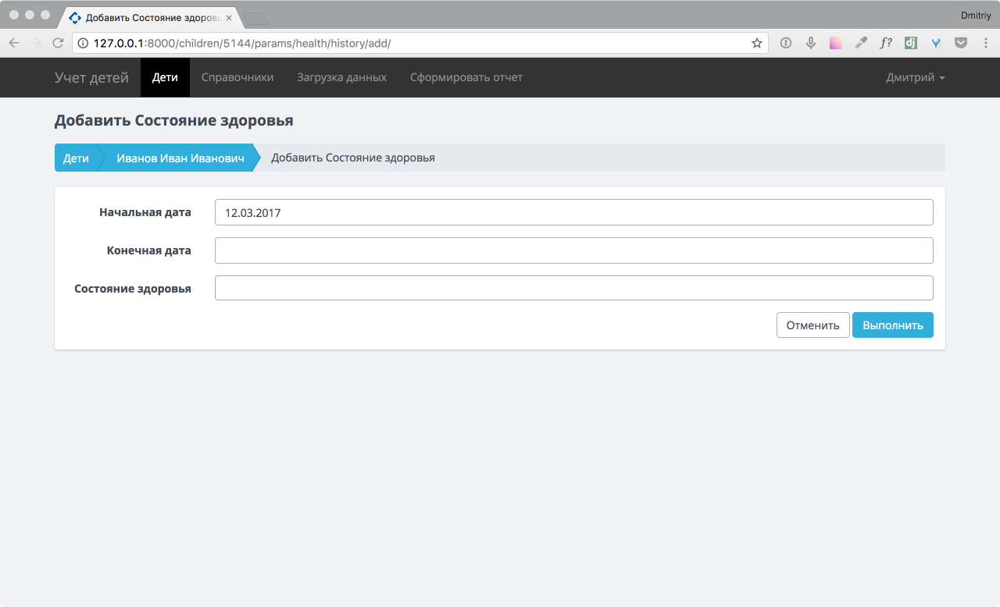

    Страница добавления истории «Состояние здоровья»

Редактирование состояния здоровья
"""""""""""""""""""""""""""""""""

На индивидуальной странице ребёнка на вкладке «Образование» нажимаем на дату в истории, которую хотите отредактировать.
В открывшейся странице изменяем нужные данные.

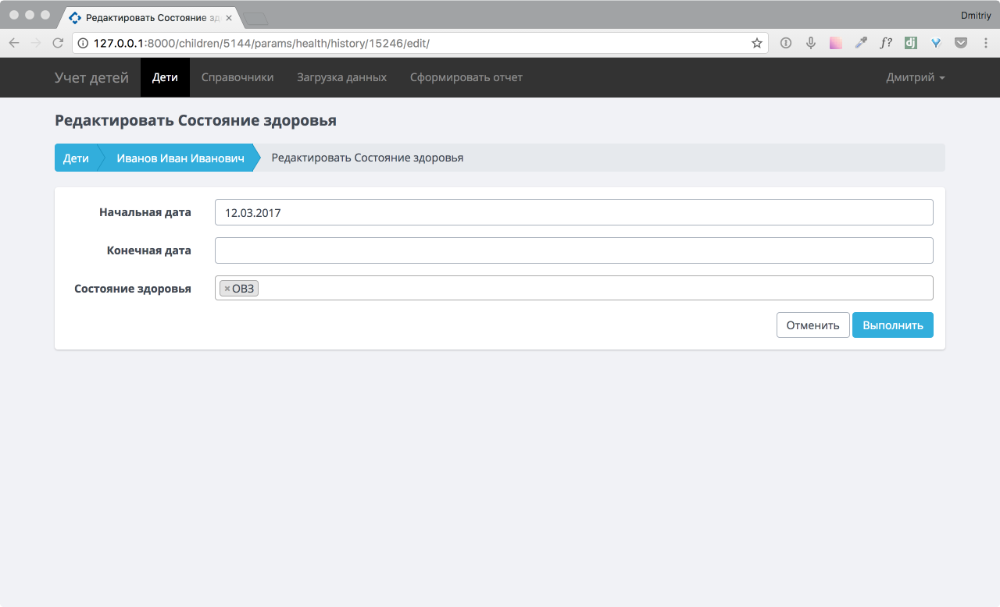

    Страница редактирования истории «Состояние здоровья»

Удаление записи о состоянии здоровья
""""""""""""""""""""""""""""""""""""

На индивидуальной странице ребёнка на вкладке «Состояние здоровья» нажимаем на крестик у записи, которую хотите удалить, в открывшемся диалоговом окне подтверждаем удаление, нажав на кнопку «Удалить»

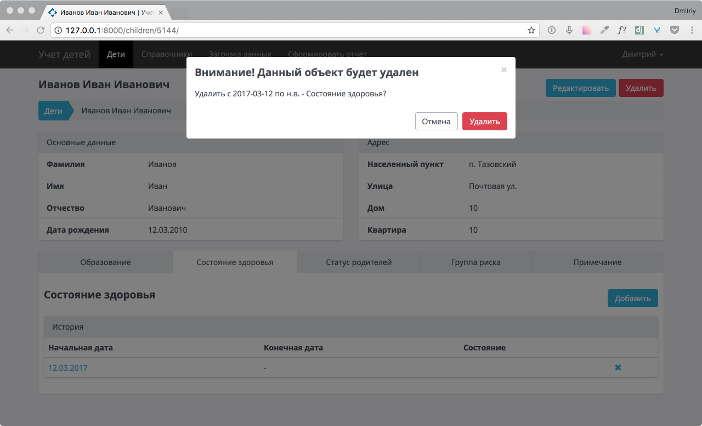

    Удаление истории «Состояние здоровья»

.. note:: *Для изменения записи состояния здоровья, например при смене диагноза (его отмене) удалять запись не надо, надо поставить дату закрытия истории.*

.. _children-parent-label:

Статус родителей
~~~~~~~~~~~~~~~~

История статуса родителей у ребёнка
Список статусов родителей берется из справочника - «Статусы родителей».

.. note:: *Статус родителей - множественный параметр, т.е. может быть выбрано несколько статусов одновременно.*

Добавление статуса родителей ребёнка
""""""""""""""""""""""""""""""""""""

На индивидуальной странице ребёнка на вкладке «Статус родителей» нажимаем кнопу «Добавить» попадаем на страницу

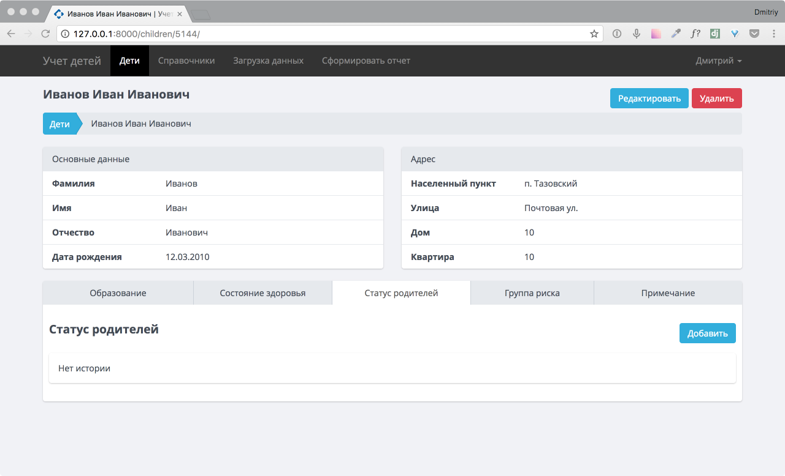

    Страница данных ребёнка - Вкладка «Статус родителей»

.. note:: *Раздел «Статус родителей» заполняются из соответствующего справочника.*

После добавления данных они появятся на индивидуальной странице в соответствующей вкладке.

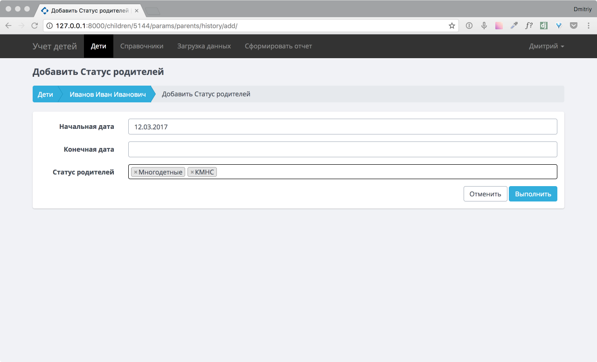

    Страница добавления истории «Статус родителей»

Редактирование статуса родителей
""""""""""""""""""""""""""""""""

На индивидуальной странице ребёнка на вкладке «Статус родителей» нажимаем на дату в истории, которую хотите отредактировать.
В открывшейся странице изменяем нужные данные.

    Страница редактирования истории «Статус родителей»

Удаление записи о статусе родителей
"""""""""""""""""""""""""""""""""""

На индивидуальной странице ребёнка на вкладке «Статус родителей» нажимаем на крестик у записи, которую хотите удалить, в открывшемся диалоговом окне подтверждаем удаление, нажав на кнопку «Удалить»

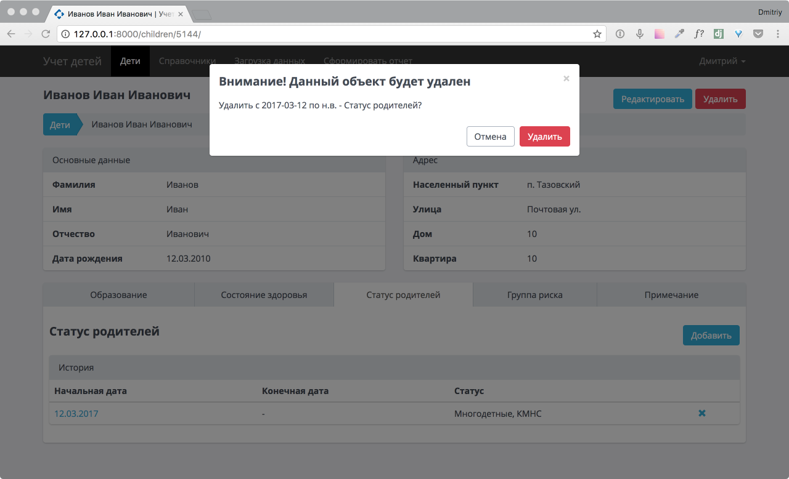

    Удаление истории «Статус родителей»

.. _children-risk-label:

Группа риска
~~~~~~~~~~~~

История в которой отмечается, относится ребенок к группе риска или нет

Добавление в группу риска
"""""""""""""""""""""""""

На индивидуальной странице ребёнка на вкладке «Группа риска» нажимаем кнопу «Добавить» попадаем на страницу

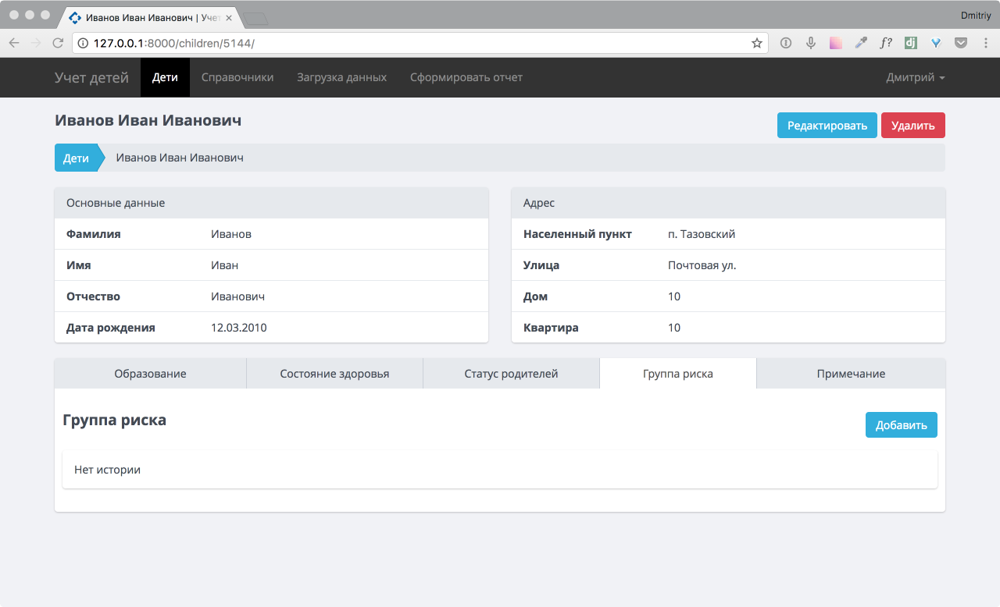

    Страница данных ребёнка - Вкладка «Группа риска»

После добавления данных они появятся на индивидуальной странице в соответствующей вкладке.

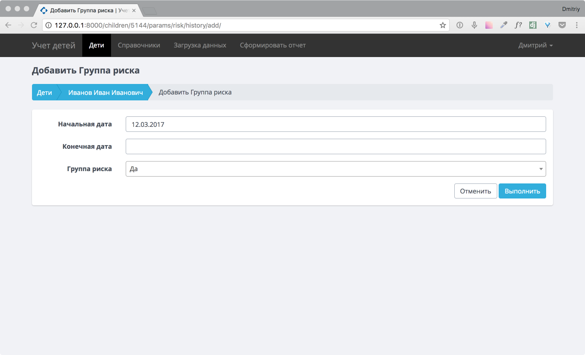

    Страница добавления истории «Группа риска»

Редактирование группы риска ребёнка
"""""""""""""""""""""""""""""""""""

На индивидуальной странице ребёнка на вкладке «Группа риска» нажимаем на дату в истории, которую хотите отредактировать.
В открывшейся странице изменяем нужные данные.

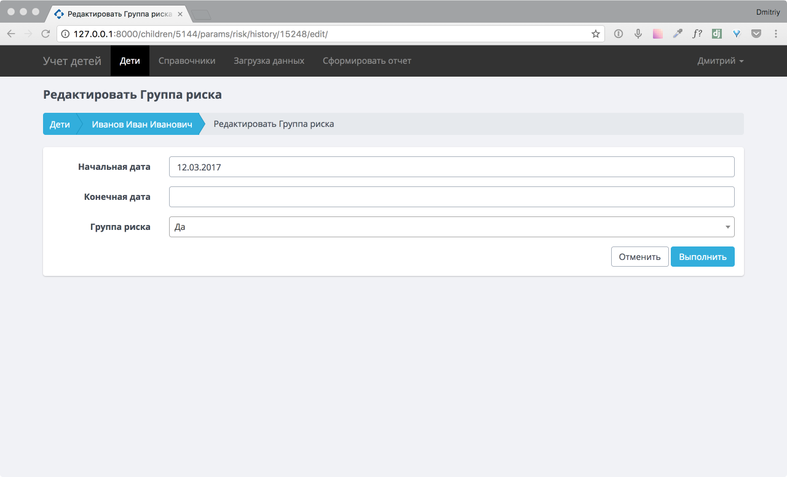

    Страница редактирования истории «Группа риска»

Удаление записи о группе риска
""""""""""""""""""""""""""""""

На индивидуальной странице ребёнка на вкладке «Группа риска» нажимаем на крестик у записи, которую хотите удалить, в открывшемся диалоговом окне подтверждаем удаление, нажав на кнопку «Удалить»

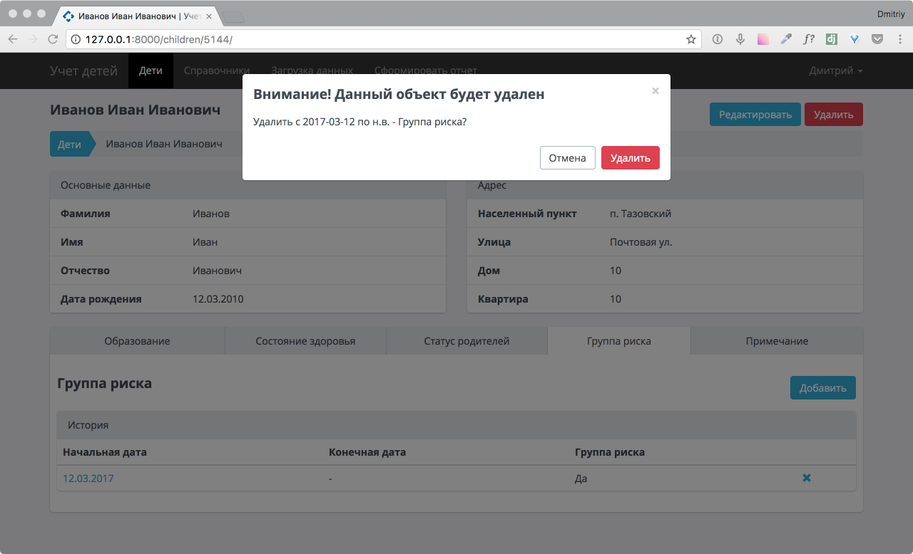

    Удаление истории «Группа риска»

.. _children-note-label:

Примечание
~~~~~~~~~~

Текстовое поле  «Примечание» с историей. Хранит пользовательский текст - заметку.

Добавление примечания
"""""""""""""""""""""

На индивидуальной странице ребёнка на вкладке «Примечание» нажимаем кнопу «Добавить» попадаем на страницу

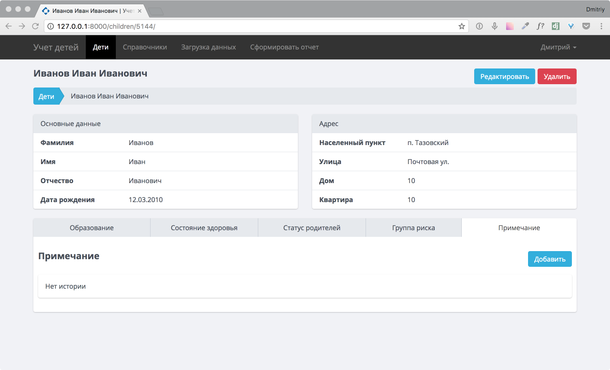

    Страница данных ребёнка - Вкладка  «Примечание»

После добавления данных они появятся на индивидуальной странице в соответствующей вкладке.

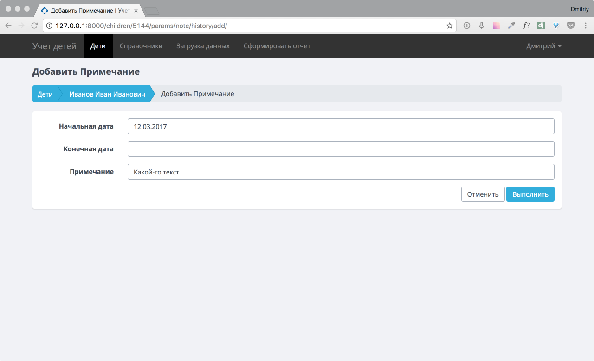

    Страница добавления истории «Примечание»

Редактирование примечания
"""""""""""""""""""""""""

На индивидуальной странице ребёнка на вкладке «Примечание» нажимаем на дату в истории, которую хотите отредактировать.
В открывшейся странице изменяем нужные данные.

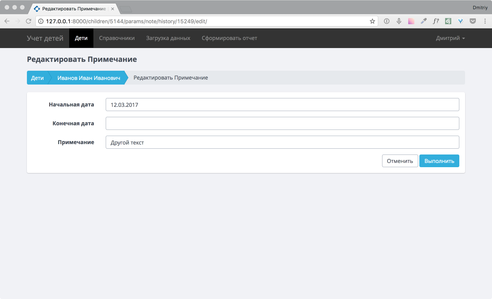

    Страница редактирования истории «Примечание»

Удаление примечания
"""""""""""""""""""

На индивидуальной странице ребёнка на вкладке «Примечание» нажимаем на крестик у записи, которую хотите удалить, в открывшемся диалоговом окне подтверждаем удаление, нажав на кнопку «Удалить»

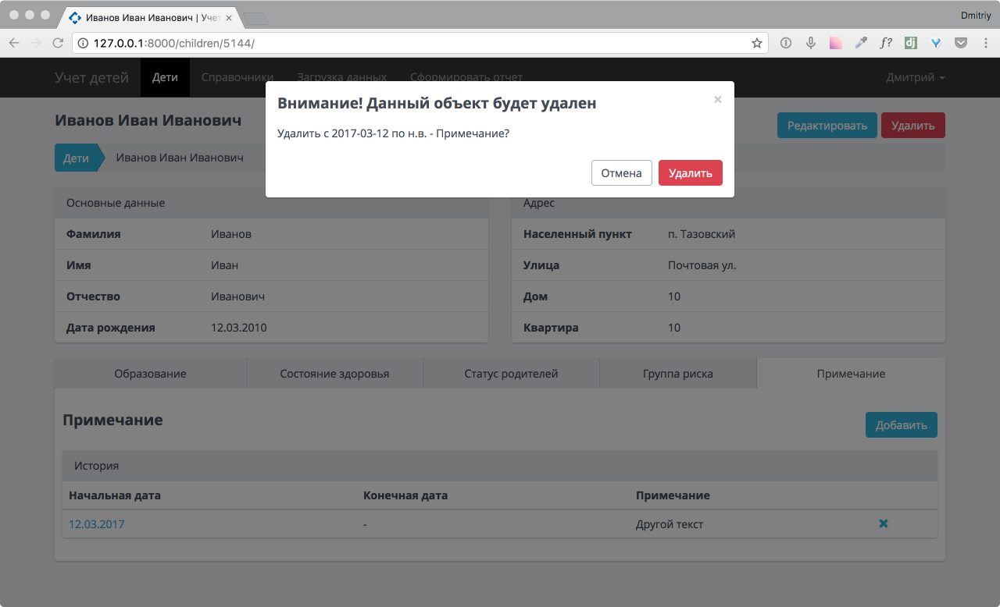

    Удаление истории «Примечание»
