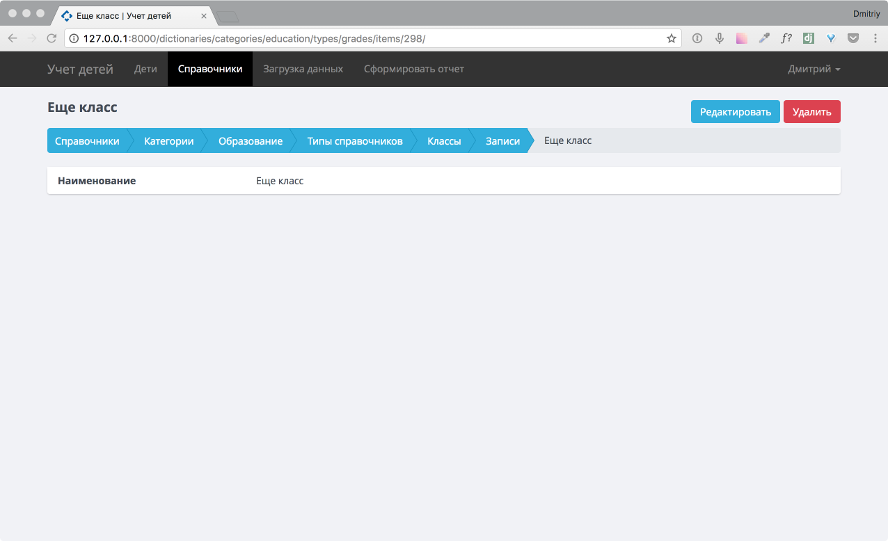

.. _dictionaries-chapter:

Раздел «Справочники»
====================
В главе рассмотрена работа с разделом «Справочники», описаны категории и справочник, применяемые в приложении.
Так же в разделе описано как редактировать, добавлять и удалять записи на примере справочника «Классы»

Переход на страницу осуществляется по нажатию кнопки «Справочники» на главном меню.

    Основная страница раздела «Справочники»

Справочники сгруппированы по категориям

* :ref:`dict-cat-education-label`
* :ref:`dict-cat-address-label`
* :ref:`dict-cat-extra-label`

.. _dict-cat-education-label:

Категория «Образование»
-----------------------

В категории «Образование» представленны следующие справочники

* :ref:`dict-class-label` - в нем настраивается список классов для заполнения истории у детей.
* :ref:`dict-group-label` - в данном справочнике настраиваются возрастные группы.
* :ref:`dict-institutions-label` - в справочнике настраиваются учреждения по которым ведется учет.

.. _dict-class-label:

Справочник «Классы»
~~~~~~~~~~~~~~~~~~~

Изначально заполнен списком с первого по одинадцатый классы.

.. _dict-group-label:

Справочник «Возрастные группы»
~~~~~~~~~~~~~~~~~~~~~~~~~~~~~~

Справочник предзаполнен следующими записями

* Группа раннего возраста с 1,5 до 2-х лет
* Первая младшая группа с 2-х до 3-х лет
* Вторая младшая группа с 3-х до 4-х лет
* Средняя группа с 4-х до 5-и лет
* Старшая группа с 5-и до 6-и лет
* Подготовительная группа с 6-ти до 7-и лет

.. _dict-institutions-label:

Справочник «Учреждения»
~~~~~~~~~~~~~~~~~~~~~~~

В справочник заносятся учреждения по которым ведется учет детей.

.. _dict-cat-address-label:

Категория «Адреса»
------------------

В категории «Адреса» представленны следующие справочники

* :ref:`dict-streets-label`
* :ref:`dict-location-label`

.. _dict-streets-label:

Справочник «Улицы»
~~~~~~~~~~~~~~~~~~

Справочник улиц всех населенных пунктов.

.. _dict-location-label:

Справочник «Населенные пункты»
~~~~~~~~~~~~~~~~~~~~~~~~~~~~~~

Населенные пункты района.

.. _dict-cat-extra-label:

Категория «Дополнительные»
--------------------------

В категории «Дополнительные» представленны следующие справочники

* :ref:`dict-parent-label` - в справочник заполняются статусы родителей, т.к. КМНС, Многодетные и др.
* :ref:`dict-health-label` - в справочник заполняются особые отметки состояния здоровья

.. _dict-parent-label:

Справочник «Статус родителей»
~~~~~~~~~~~~~~~~~~~~~~~~~~~~~

В справочник заполняются статусы родителей.

.. _dict-health-label:

Справочник «Состояния здоровья»
~~~~~~~~~~~~~~~~~~~~~~~~~~~~~~~

В справочник заполняются особые отметки состояния здоровья.

Основные операции со справочниками
----------------------------------

Расмотрим основной общий принцип работы с любым справочником.
Расмотрим принцип работы на примере справочника «Классы», т.к. для других справочников будет все аналогично.

Добавление записи в справочник
~~~~~~~~~~~~~~~~~~~~~~~~~~~~~~

Для добавления записи перейдем на нужный нам справочник с основной страницы раздела «Справочники», нажав на нужный справочник.
Попадем на страницу с записями справочника.

.. figure:: _static/dict_class_list.png
    :align: center
    :alt: Страница с записями справочника «Классы»

    Страница с записями справочника «Классы»

Нажав на кнопку «Добавить», откроется страница для ввода записей.

Введя нужные данные, нажимаем кнопку «Выполнить».
Добавится запись в справочник.

    Страница добавления записи в справочник «Классы»

Редактирование записи в справочнике
~~~~~~~~~~~~~~~~~~~~~~~~~~~~~~~~~~~

Что бы редактировать запись в справочнике, нажимаем на соответствующую запись в нем. Попадаем на страницу записи, в которй для редактирования записи нажимаем кнопу «Редактировать».

    Страница записи в справочнике «Классы»

Удаление записи в справочнике
~~~~~~~~~~~~~~~~~~~~~~~~~~~~~

Со страницы записи в справочнике (см. рис. выше), нажав на кнопку «Удалить» и подтвердив удаление повторно нажав на «Удалить».

    Удаление записи в справочнике «Классы»
