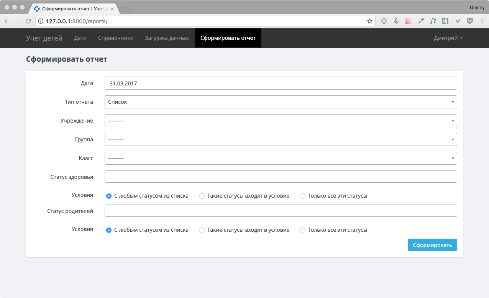

.. _reports-chapter:

Раздел «Сформировать отчет»
===========================
В главе рассмотрена работа с разделом «Сформировать отчет», описаны выбороки для формирования сводной отчетности по учреждениям и сгруппированного списка детей по возрасту

    Страница раздела «Сформировать отчет»

Фильтр данных
-------------

Фильтр дает возможность отобрать данные на дату по следующим показателям.

* Дата - данные будут выбранны на эту дату
* Учреждение - будет влючены дети, обучающиеся в выбранном учреждении
* Группа - будет влючены дети, относящиеся к выбранной возростной группе
* Класс - будет влючены дети, относящиеся к выбраннму классу
* Статус родителей - будут выбранны дети с указанными статусами родителей.
    Необходимо уточнить условия поиска выбрав из указанного списка

    * С любым статусом из списка - в данное условие попадают дети относящиеся к выбранным условиям «или-или», т.е., если мы указали в условии «КМНС» и «Многодетные» то выбирутся дети со статусом родителей или «КМНС» или «Многодетные»
    * Такие статусы входят в условие - в данное условие попадают дети относящиеся к выбранным условиям «и-и», т.е., если мы указали в условии «КМНС» и «Многодетные» то выбирутся дети со статусом родителей и «КМНС» и «Многодетные» и также содержащиеся другие условия
    * Только все эти статусы - в данное условие попадают дети относящиеся к выбранным условиям «и-и», т.е., если мы указали в условии «КМНС» и «Многодетные» то выбирутся дети со статусом родителей только «КМНС» и «Многодетные» и не содержащие никаких других статусов.

* Статус здоровья - будут выбранны дети с указанными статусами здоровья.Необходимо уточнить условия поиска выбрав из указанного списка.
    Аналогично как и со статусами родителей

    * С любым статусом из списка
    * Такие статусы входят в условие
    * Только все эти статусы

Тип отчета «Список»
-------------------

Формирутся при выборе варианта тип отчета - «Список».

Тип отчета «Свод»
-----------------

Формирутся при выборе варианта тип отчета - «Свод».
