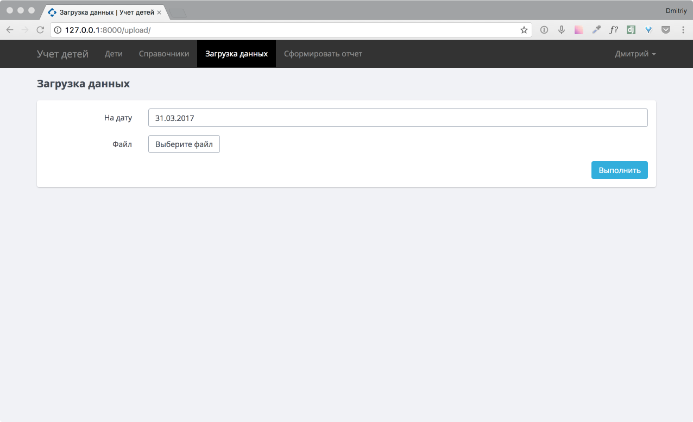
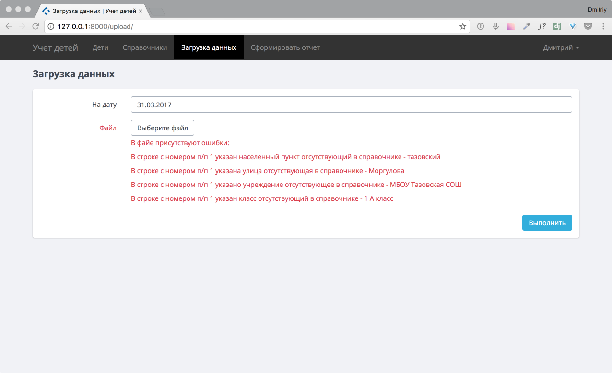

.. _upload-chapter:

Раздел «Загрузка данных»
========================

В главе рассмотрена работа с разделом «Загрузка данных».

Переход на страницу осуществляется по нажатию кнопки «Загрузка данных» на главном меню.

    Основная страница раздела «Загрузка данных»

Загрузка данных
---------------

Для загрузки данных выбираем на какую дату будут загружены данные, выбираем файл и нажимаем «Выполнить»
Если в файле существуют несоответствующие данные, выйдет список ошибок с расхождениями, исправив которые, файл загрузится.

    Вывод ошибок при загрузке файла
